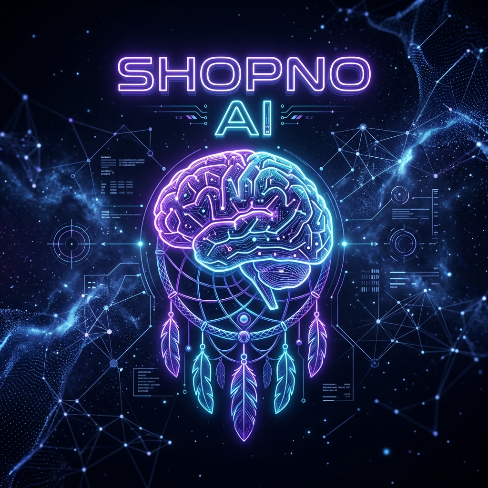

<div align="center">
  

  <h1>Shopno AI CLI</h1>

  <p>
    <strong>AI command center for coding, automation, research, local models, cloud models, and human workflows.</strong><br>
    v1.0.3 · Made By Bangladesh · Built by Sourov / Cyber Prince.
  </p>

  <p>
    
    
    
  </p>

  <p>
    <a href="https://surveymentor.org/shopno/register.php"><strong>Create Account</strong></a>
    |
    <a href="https://surveymentor.org/shopno/login.php"><strong>Login</strong></a>
    |
    <a href="https://github.com/CyberPrince-Alien/Shopno-AI"><strong>GitHub Repo</strong></a>
    |
    <a href="https://surveymentor.org/shopno/support.php"><strong>Support</strong></a>
    |
    <a href="https://surveymentor.org/shopno/version_history.php"><strong>Version History</strong></a>
  </p>
</div>

---

## What Is Shopno AI CLI?

Shopno AI CLI is a professional AI command center for coding, project work, local automation, research, browser work, local AI, managed cloud AI access, and admin-controlled SaaS distribution.

Users do not need to bring provider API keys. They log in with a Shopno account, choose an enabled model, and work through the protected Shopno SaaS gateway. Admins keep control of subscriptions, quotas, model access, provider keys, downloads, announcements, support messages, maintenance mode, and payment approvals.

Shopno is built for a real software business: users get a polished CLI experience, while the owner keeps server-side control of cost, security, model access, provider keys, SMTP, downloads, subscriptions, and product access.

Version `v1.0.3` adds the restored Gemini CLI-style responsive logo, `Made By Bangladesh` branding, large paste mode, latest-session resume, stronger SMTP handling, and updated public documentation.

---

## Command Center Preview

```text
READY  Shopno AI Coding Agent
v1.0.3  Made By Bangladesh

+----------------------------------------------------------------+
| SHOPNO COMMAND CENTER                                          |
| Active Model: managed-model                                    |
+----------------------------------------------------------------+
| [1] START SHOPNO CLI (54 Features Enabled)                     |
|      Launch with active or last used model                     |
|                                                                |
| [2] CHOOSE MODEL FOR USE                                       |
|      Managed model catalog - no API key required               |
|                                                                |
| [3] OLLAMA LOCAL                                               |
|      Auto-install, model puller, local runtime                 |
|                                                                |
| [4] REMOTE CONTROL WITH WHATSAPP                               |
|      Pair WhatsApp and operate Shopno remotely                 |
|                                                                |
| [5] CYBER PRINCE LOCAL LLM                                     |
|      Offline/local GGUF-style models through Ollama            |
|                                                                |
| [6] BITNET LOCAL LLM                                           |
|      1-bit and tiny local models when supported                |
|                                                                |
| [7] SAVED PROFILES                                             |
| [8] LOGOUT USER                                                |
| [9] EXIT COMMAND                                               |
+----------------------------------------------------------------+
```

---

## Core Features

| Area | What Shopno Provides |
| --- | --- |
| Managed Cloud Models | Users choose model names only; API keys and provider routing stay hidden. |
| Secure SaaS Gateway | Server-side auth, device binding, tier checks, quota enforcement, and fallback. |
| Local Ollama | Unlimited local model usage on the user's own machine. No SaaS quota counted. |
| Big Paste Mode | Use `<<<` and `>>>` to paste long files, SQL, logs, transcripts, and documents safely. |
| Session Resume | Saved sessions, `/resume-latest`, `/sessions`, `/resume <id>`, and compaction. |
| Automation Core | IFTTT/n8n-style recipes, connectors, outbox, retries, webhooks, email, blogs, Drive, Sheets, YouTube, and browser workflows. |
| Browser Bridge | Open pages, inspect elements, click, type, screenshot, and record repeatable workflows. |
| Research Core | Evidence notebooks, source cards, repo digest, project graph, and semantic context. |
| Proof Core | Eval harness, trace timeline, vault, repo digest, and React/Vite/Next/Tailwind diagnostics. |
| Voice Core | Low-resource typed voice loop, profiles, TTS preview, and consent-gated clone sample registration. |
| PowerToys Core | Command palette, modules, quick actions, workspaces, backup/restore, awake, file locksmith, and hotkeys. |
| Subscription System | Free, Pro, and Ultra access can be controlled from the admin panel. |
| Model Tier Control | Admin can enable/disable models and assign Free/Pro/Ultra access. |
| Key Vault | Provider keys and account tokens are stored server-side and protected. |
| Device Lock | One account, one active device, with logout-all-session recovery. |
| Download Portal | Windows, Mac, Linux links and version history are admin controlled. |
| Support Flow | Customers can send support messages and admins can reply. |
| Email System | SMTP settings, password reset, announcements, renewal/upgrade notices. |
| Maintenance Mode | Admin can pause the public app safely during updates. |
| Binary Release | Public users receive only the packaged executable and docs. |

---

## Cloud vs Local Usage

| Mode | Cost Source | Quota? | Best For |
| --- | --- | --- | --- |
| `CHOOSE MODEL FOR USE` | Shopno SaaS cloud gateway | Yes | Managed premium cloud models |
| `OLLAMA LOCAL` | User's own computer | No | Unlimited local/offline usage |
| WhatsApp Remote + Cloud Profile | Shopno SaaS cloud gateway | Yes | Remote control with managed models |
| WhatsApp Remote + Ollama Profile | User's own computer | No | Remote local automation |

Ollama Local is intentionally unlimited because it uses the user's own CPU/GPU/RAM and local model runtime.

---

## User Flow

1. Download the official release ZIP.
2. Run `Shopno-CLI.exe`.
3. Login with a Shopno account.
4. Select `CHOOSE MODEL FOR USE` for managed cloud models.
5. Select `OLLAMA LOCAL` for unlimited local models.
6. Start Shopno CLI and work from the command center.
7. Paste large context with `<<< ... >>>` when needed.
8. If the CLI closes or hangs, restart and run `/resume-latest`.

If the same account is active on another device, Shopno shows a device conflict and lets the user clear all previous sessions before logging in again.

---

## Model Access

Shopno can expose premium model names while hiding all provider details.

Users may see categories such as:

- GPT coding models
- Claude coding models
- Gemini models
- NVIDIA models
- OpenRouter models
- Groq models
- Pollinations models
- GitHub Copilot models
- Codex login models
- Ollama local models

The exact list is controlled from the admin panel by plan, availability, and business cost.

---

## Plans

| Plan | Best For | Access |
| --- | --- | --- |
| Free | Trial users | Limited admin-selected access |
| Pro | Active developers | Managed cloud models with generous daily fair-use |
| Ultra | Heavy users and teams | Higher quota and premium model tier access |

Plan prices, quotas, expiration, payment approval, model access, and upgrade notices are controlled from the Shopno admin panel.

---

## Download Package

Recommended public release contents:

```text
Shopno-CLI.exe
README.md
LICENSE.md
USER_GUIDE.md
SHOPNO_HANDBOOK.md
SHOPNO_HANDBOOK.pdf
SHOPNO_USER_A_TO_Z_BOOK.md
SHOPNO_USER_A_TO_Z_BOOK.pdf
RELEASE_NOTES_v1.0.3.md
SECURITY.md
BINARY_DISTRIBUTION.md
```

Do not publish:

```text
src/
Admin Panel Shopno/
.shopno/
.env
build/
database exports with real credentials
provider keys
OAuth tokens
vault secrets
server config files
```

---

## Security Model

Shopno is designed so public users never receive your provider keys.

- Provider credentials stay on the server.
- New keys are encrypted before storage.
- CLI users receive only a device-bound Shopno session.
- Gateway requests validate auth token and active device.
- Model lists show model names only.
- Provider routing and fallback order are not exposed to users.
- Second-device login is blocked unless sessions are cleared.
- Public release packages must not contain source, cache, `.shopno`, `.env`, or secrets.

Read [`SECURITY.md`](SECURITY.md) before publishing a release.

---

## GitHub Pages Landing

A static GitHub Pages landing page is available in:

```text
github-pages/index.html
```

Repository:

```text
https://github.com/CyberPrince-Alien/Shopno-AI
```

Expected GitHub Pages URL after enabling Pages:

```text
https://cyberprince-alien.github.io/Shopno-AI/
```

It can run from a GitHub Pages domain. Login, register, support, dashboard, download portal, and version history redirect to the live Shopno server:

```text
https://surveymentor.org/shopno
```

When the final domain is ready, update `SHOPNO_SERVER` inside `github-pages/index.html`.

---

## Android Remote App

Phase 1 Android remote-control source is available in:

```text
android-remote/
```

It supports:

- Shopno account login
- device-bound session handling
- logout-all-session recovery
- managed cloud model list
- prompt sending to the Shopno SaaS gateway
- streaming AI response display

This is a cloud remote app. Full PC file editing and terminal execution will require the next phase PC-side remote agent.

Build it with Android Studio:

```text
Open android-remote > Build > Build Bundle(s) / APK(s) > Build APK(s)
```

---

## Built-In Creative Core

Shopno includes local-first command modules that do not require copying external project folders:

```text
shopno motion status
shopno music status
shopno voice status
shopno automate status
shopno automate connectors
shopno automate create-social --name "Blog distribution"
shopno automate configure wordpress --profile "main-site"
shopno automate run-all
shopno automate share 1 --title "My Blog" --url "https://example.com/post" --excerpt "Short summary"
shopno research status
shopno research add README.md --notebook project
shopno research search "provider routing"
shopno upgrades
shopno design audit
shopno design init
shopno voice profiles
shopno voice say "I am ready to help" --dry-run
```

Voice Core is designed for low-resource PCs. It starts with typed fallback, detects optional local speech engines such as Windows SAPI or `pyttsx3`, and stores voice profiles in Shopno state. Voice clone sample registration is consent-gated and should only be used for your own voice or a voice you have permission to use.

Evidence Notebook Core stores files and URLs as source cards with summaries, tags, confidence, and stable source IDs. Shopno uses it for reference-heavy work so claims can be tied back to evidence instead of chat memory.

Design Quality Gate audits frontend and visual artifacts before Shopno calls them done. It checks for a design contract, generic AI-slop patterns, responsive signals, accessibility basics, real asset usage, and verification readiness.

In chat, these slash commands are available:

```text
/motion
/music
/voice
/research
/upgrades
/voice profiles
/voice persona
/voice say <text>
```

---

## Documentation

| File | Purpose |
| --- | --- |
| [`USER_GUIDE.md`](USER_GUIDE.md) | User login, model selection, fair-use, and local mode |
| [`SECURITY.md`](SECURITY.md) | Release safety, key handling, and device binding |
| [`BINARY_DISTRIBUTION.md`](BINARY_DISTRIBUTION.md) | What to include in public ZIP releases |
| [`LICENSE.md`](LICENSE.md) | Proprietary commercial license |

---

## License

Shopno AI CLI is proprietary commercial software owned by **Sourov**, also known as **Cyber Prince**.

Users may run the official binary with an active Shopno account, subscription, trial, or written permission. Source code, admin panel code, server files, credentials, provider tokens, gateway internals, and private build assets must not be copied, modified, reverse engineered, republished, or redistributed.

See [`LICENSE.md`](LICENSE.md) for full terms.

---

## Owner

```text
Product: Shopno AI CLI
Owner: Sourov
Internet Name: Cyber Prince
Type: Proprietary SaaS + Binary AI Coding Agent
```

<div align="center">
  <strong>Shopno AI CLI</strong><br>
  Managed AI coding for serious developers.
</div>
